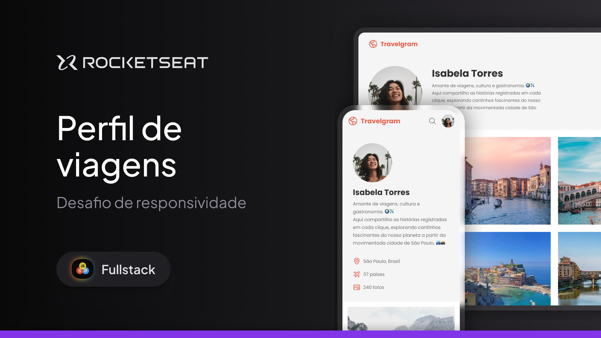

# Formação Full-Stack: Travelgram

Acesse em: <a href="https://limacaiquelg.github.io/fullstack-travelgram/">https://limacaiquelg.github.io/fullstack-travelgram/</a>

 

Este projeto consiste em uma página web desenvolvida utilizando HTML e CSS. Esta página exibe um perfil na aplicação Travelgram, onde é possível ver a foto de perfil, nome, biografia e algumas fotos postadas.
 

Os seguintes tópicos são trabalhados nesta aplicação: 

<ul>
  <li>Criação de layouts com CSS</li>
  <li>Posicionamento de elementos</li>
  <li>Variáveis CSS</li>
  <li>CSS Flexbox</li>
  <li>CSS Grid</li>
  <li>Pseudo-classes e pseudo-elementos</li>
</ul>

Este projeto foi desenvolvido durante a formação Full-Stack da Rocketseat, sob a orientação do professor <a href="https://github.com/maykbrito">Mayk Brito</a>. Posteriormente, tornou-se parte do desafio de responsividade dessa mesma formação, trabalhando os seguintes tópicos: 

<ul>
    <li>Responsividade</li>
    <li>Media Queries</li>
    <li>Utilização da ferramenta DevTools do navegador</li>
</ul>

As alterações necessárias para tornar a página responsiva estão contidas no commit <a href="https://github.com/limacaiquelg/fullstack-travelgram/commit/7174e2376f8c74a4cbc9089e8c8b815aae8c0c2f">7174e23</a> e <a href="https://github.com/limacaiquelg/fullstack-travelgram/commit/e9f6ebaef7d60c35978d0731f60470f07f8cb759">e9f6eba</a>.

Este projeto faz parte da formação Full-Stack da <a href="https://www.rocketseat.com.br">Rocketseat</a>.

